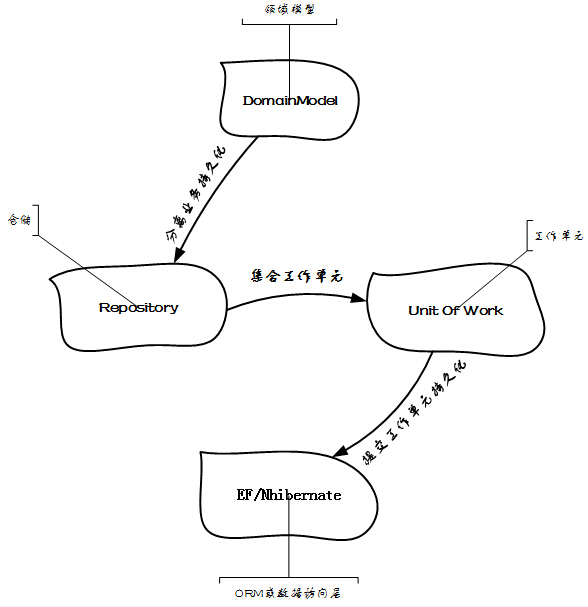

关于Unit of work更多信息,请看[http://martinfowler.com/eaaCatalog/unitOfWork.html](http://martinfowler.com/eaaCatalog/unitOfWork.html).

工作单元类似于事务操作,多个任务要么同时完成,要么都不能完成.完成了Commit,完不成Rollback.和EF中的Context很类似.对于Unit of work接口定义的实现,就是EF中的Context操作.

**简单使用场景**
```csharp
// 使用工厂或者依赖注入,不要直接New
using (IRepositoryContext repositoryContext = new EntityFrameworkRepositoryContext())
{
      IContactRepository contactRepository = new ContactRepository(repositoryContext);
      IMessageRepository messageRepository = new MessageRepository(repositoryContext);
      ..........
      repositoryContext.Commit();
}
```
IRepositoryContext 接口继承于 IUnitOfWork 接口,在 EntityFrameworkRepositoryContext 的具体实现中,对 UOW 进行了简单重写实现,用的就是 EF,所以,你可以把 repositoryContext 对象看作是 UOW,下面是 Repository 对象的创建,传递的是 UOW 具体实现,因为在一个 using 块中,所以,UOW 的生命周期可以跨 Repository 共享,那关于 Repository 中的 UOW 如何定义的呢？其实就是单例实现,也可以进行构造函数注入后进行单例, repositoryContext 访问的 Commit 操作，其实就是 IUnitOfWork 接口中进行定义的.

Unit of work用来解决**领域模型存储**和**变更**工作. ORM的持久化操作时,如EF的SaveChanges操作,就可以看成是Unit of work.

Unit of work必须独立于Domain Layer,是"数据层面"的业务,而不是业务逻辑层面的"业务",例如"转账业务",转出方扣钱和转入方价钱这个业务就属于"数据层业务",所以将Unit of work放在Domain Layer是不恰当的.应该放在Infrastructure Layer中,但是如果涉及到具体的业务单元模块,具体实现就可以放在Domain Layer中.

在DDD开发中,工作单元一般会结合Repository(仓储)使用.关于仓储可以看dud的文章[http://www.cnblogs.com/dudu/archive/2011/05/25/repository_pattern.html](http://www.cnblogs.com/dudu/archive/2011/05/25/repository_pattern.html),大致解释:

>Repository：是一个独立的层，介于领域层与数据映射层（数据访问层）之间. 它的存在让领域层感觉不到数据访问层的存在，它提供一个类似集合的接口提供给领域层进行领域对象的访问. Repository是仓库管理员，领域层需要什么东西只需告诉仓库管理员，由仓库管理员把东西拿给它，并不需要知道东西实际放在哪.

关于Repository和unit Of Work关系,示意图:

